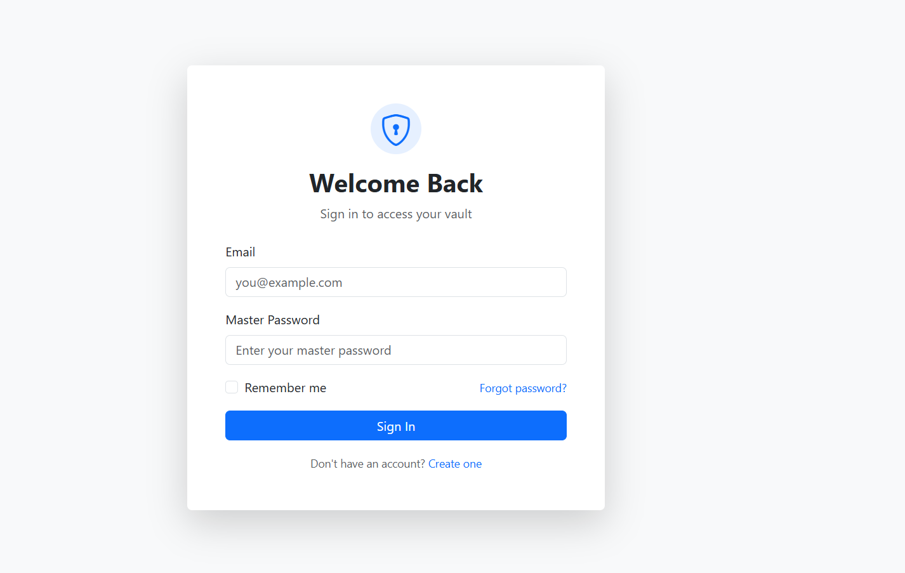
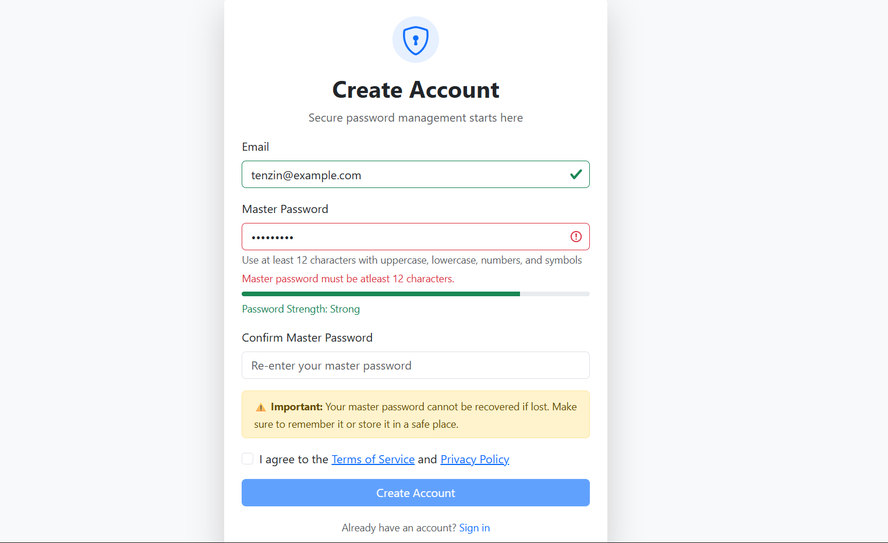
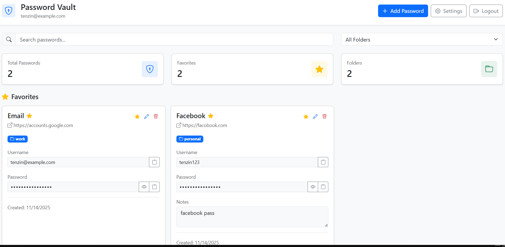

# password_manager
A simple password manager project done for my **Secure Coding** module.

## Overview
This project was built to fulfil my secure coding assessment, it's a simple password manager that does, well what a typical password manager does, it allows you to store your passwords securely so that you just have to remember one password(the password manager's password, the **master password**) and the password manager stores rest of the passwords for you. Since a password managers role is to keep one of the most important secrets of a user safe and not one of it but several of it, a compromise of the application can have devastating impacts on the users. Hence, inorder to remove the possibility of a comrpomise it is essential to ensure that the application owner and developers themselves have no knowledge of the passwords stored, this architecture in technical terms is known as a zero-knowledge architecture and every modern password manager uses it. 

So how do we ensure a zero-knowledge architecture? If the application itself doesn't have any knowledge of the data stored then how is it supposed to handle stuff like authentication? The answer is cryptography, through the use of encryption, hashing and key derivation functions. More on this is discussed below.

**Disclaimer:** This project was mostly vibe coded with **Anthropic's claude**. Prior to building this project I had **little to no** **typescript** knowledge, although writing typescript itself is simple, using it build a fullstack app is quite complicated with every developer suggesting a different way to organize and build your project. Hence, I instead decided to ask claude to teach me how to build a standard typescript project and it came up with the entire project structure.

## Tech Stack
### Frontend.
- **Vite** with **React** and **Typescript**
- **hash-wasm:** For browser crypto utilities.
- **redux toolkit:** For state management.
- **axios:** For making API calls.
- **bootstrap & react bootstrap:** For faster styling and building UI.
- **Zod:** For typesafe schema definition and validation.

### Backend.
- **Express**
- **Bcrypt**
- **Zod**
- **helmet:** For secure HTTP headers
- **Sequelize:** Postgres ORM.
- **speakeasy:** For TOTP generation and validation.

## Security Features.
Since most of us are familiar with the visible features of a password manager I will only be discussing the security features implemented in this project.

1. **Zero-knowledge architecture**
   This is the main security feature. When the user registers they create a password called the master password and this password is never stored directly anywhere within the application but rather it is hashed in the client side using **Argon2ID** which is a hybrid of the **Argon2I** and **Argon2D** variants. The hashed master master is sent to the server and there the server again hashes it with bcrypt before storing it in the database.

   The Argon2ID hash of the master password is then used as the encryption key to encrypt all the user's stored passwords before sending them to the server to be stored in the database. Hence, as long as the user keeps the master password safe there is no way an attacker could get access to the users passwords even if a data breach were to occur.

2. **Double password hashing**
   - Client: Argon2 (memory-hard, GPU-resistant)
   - Server: bcrypt (additional security layer)

3. **JWT authentication**
   - Short-lived access tokens (15 min)
   - Long-lived refresh tokens (7 days)
   - Separate secrets for each token type

4. **Brute force protection**
   - Rate limiting (5 attempts per 15 min per IP)
   - Account locking (5 failed logins → 15 min lockout)
   - Timing-safe comparisons

5. **XSS/CSRF protection**
   - httpOnly cookies for refresh tokens
   - CORS configuration
   - Helmet security headers

## Screenshots
### Login Page

### Signup Page

### Vault Page
